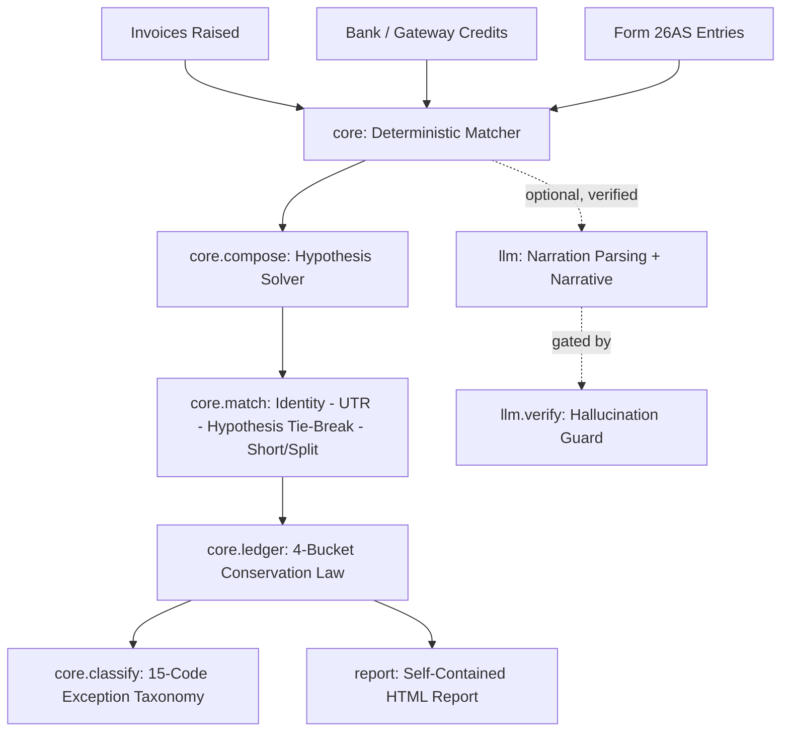

<a id="readme-top"></a>

<!-- PROJECT TITLE -->
<h1 align="center">👻 Ghost Rupees - AI-Powered Payment Reconciliation Engine 💸</h1>

<p align="center">
  <strong>Ghost Rupees finds every rupee you invoiced (received, lawfully deducted, silently vanished, or still owed) and proves it in integer paisa, not a guess.</strong>
</p>

<p align="center">
  AI Finance Controller
</p>

<br>


## 📌 Table of Contents
<details>
  <summary>Click to Expand</summary>
  <ol>
    <li><a href="#overview">🌟 Overview</a></li>
    <li><a href="#the-number">📊 The Number</a></li>
    <li><a href="#features">✨ Key Features</a></li>
    <li><a href="#tech-stack">🛠️ Tech Stack</a></li>
    <li><a href="#project-architecture">🏗️ Project Architecture</a></li>
    <li><a href="#installation">⚡ Installation & Quick Start</a></li>
    <li><a href="#ai-boundary">🧠 Where AI Is (and Isn't) Trusted</a></li>
    <li><a href="#limitations">🔍 Limitations (Honest, Not Hidden)</a></li>
    <li><a href="#future-scope">🔮 Future Scope</a></li>
  </ol>
</details>

---

<a id="overview"></a>
## 🌟 Overview

**Ghost Rupees** is an **AI-assisted financial reconciliation engine** built for freelancers and small businesses who invoice clients and then watch money arrive **short, late, or silently deducted** with no explanation attached.

It joins **three sources that nothing today joins**: the invoice you raised, the bank/gateway credit you actually received, and the TDS your client claims to have deducted in **Form 26AS**. Every invoice is decomposed into exactly four buckets (received, lawfully deducted and creditable, deducted but **never deposited with the government**, or short), and those four buckets are mathematically asserted to sum to the invoiced total, in integer paisa, on every single run.

💡 **Problem Ghost Rupees Solves**
A client deducts tax from your invoice and never actually pays it to the government. Nobody tells you. It just vanishes, like a ghost. Ghost Rupees treats reconciliation as a conservation law, not a spreadsheet guess: **every rupee has to end up somewhere, proven or named.**

---

<a id="the-number"></a>
## 📊 The Number

On a 66-invoice synthetic batch, Ghost Rupees auto-matched **75.76%** of invoices to a bank/gateway credit with **zero manual intervention**, and accounted for **100.00% of the money by construction**. Along the way it surfaced **Rs 36,575.82** sitting in TDS deductions that were never deposited with the government, uncorrected rate mismatches, and short payments with no lawful basis: money that would otherwise simply go unnoticed.

On a separate 14-defect held-out evaluation batch with known ground truth, it correctly classified **13 of 14** planted defects. The 14th is an **honestly documented gap** (FX-spread handling isn't built yet), not a silent miss.

The auto-match rate is deliberately not the highest number this engine could report. It declines to guess rather than silently resolving an ambiguous tie by chance. A lower number that can be trusted beats a higher one that occasionally can't.

| Metric | Value |
|---|---|
| Invoices / credits / clients | 66 / 73 / 10 |
| Auto-match rate | 75.76% |
| Rupees accounted for | 100.00% (by construction) |
| Rupees at risk (undeposited TDS + rate mismatches + short-pays) | Rs 36,575.82 |
| 14-defect held-out eval | 13/14 correct, 0 false positives, 1 documented gap |
| Identity-carrying credits A/B | 50.00% → 100.00% auto-match |

---

<a id="features"></a>
## ✨ Key Features

- 🤖 **AI-Assisted Narration Parsing** - turns messy bank/UPI narration text into structured counterparty data no regex reliably handles, used only to break ties, never to move money.
- 🧾 **Conservation-Law Reconciliation** - every invoice's gross amount is decomposed into 4 buckets asserted to sum exactly to the invoiced total, in integer paisa, or the run fails loudly.
- 🕵️ **Ghost Money Detection** - automatically finds TDS that was deducted from you but never deposited with the government (`DEDUCTED_UNCREDITABLE`), a number nothing else in this space computes.
- 📐 **Hypothesis-Based Matching** - enumerates every lawful/common-error deduction hypothesis (TDS, GST, platform commission, gateway fees) and matches on predicted net, not raw gross.
- 🔗 **Identity-Carrying Credit Resolution** - a dedicated per-client credit identifier removes amount/date guesswork entirely, measured at a real +50 percentage point auto-match improvement.
- 📜 **FY-Versioned, Cited Tax Rules** - TDS/GST rate tables versioned by financial year, including the 194-series → Income Tax Act 2025 Section 393 citation change.
- 🛡️ **AI on a Leash** - `core/` can never import `llm/` (enforced by an AST-walking test, not a convention); every LLM output is verified against raw source text before anything downstream trusts it.

---

<a id="tech-stack"></a>
## 🛠️ Tech Stack

| Layer | Technology Used |
| ----------------- | ---------------- |
| **Core Engine** | Python (standard library only, zero dependencies on the deterministic path) |
| **AI/LLM Layer** | LLM-based narration parsing, structured JSON output |
| **Payments Data** | Payment gateway test-mode API (customers, invoices, payment links, orders) |
| **Testing** | pytest (52 tests, ~0.5s, no network required) |
| **Reporting** | Self-contained, dependency-free HTML report builder |
| **Money Handling** | Integer paisa throughout, raw floats rejected outright (`core/money.py`) |

---

<a id="project-architecture"></a>
## 🏗️ Project Architecture



`core/` never imports `llm/`. An AI model never touches the money, it only reads messy bank text, and even then every claimed fact is checked against the raw source before anything downstream trusts it.

---

<a id="installation"></a>
## ⚡ Installation & Quick Start

Follow these steps to run **Ghost Rupees** locally. The core reconciliation engine needs nothing but Python; the AI layer is optional and additive.

### **1. Prerequisites**

- [Python](https://www.python.org/) >= 3.10
- (Optional, for live fixtures) a payment gateway's test-mode API keys

### **2. Clone & Run the Core Engine**

```bash
git clone https://github.com/sanaysarthak/ghost-rupees.git
cd ghost-rupees
python cli.py run
```

No API key needed, no `pip install` needed. The deterministic engine is pure standard library. This loads the committed golden batch, runs the matcher, prints a summary, asserts the conservation law, and writes a self-contained report to `report/out/report.html`.

### **3. Run the Test Suite**

```bash
python -m pytest -q
```
- ✅ 52 tests, ~0.5 seconds, zero network calls.

### **4. Fetch Real Payment Gateway Fixtures (Optional)**

```bash
export RAZORPAY_KEY_ID="rzp_test_..."
export RAZORPAY_KEY_SECRET="..."
python data/fetch_razorpay_fixtures.py
```
- 🔒 Refuses to run against anything but a test-mode key, and scans every saved file for the literal secret string before writing it to disk.

### **5. See the Identity-Resolution Argument, Measured**

```bash
python eval/smart_collect_ab.py
```
- 📈 Same invoices, same amounts, same dates. The only difference is whether the credit carries a dedicated per-client identifier. Measured result: **50.00% → 100.00%** auto-match.

---

<a id="ai-boundary"></a>
## 🧠 Where AI Is (and Isn't) Trusted

**The trust boundary, in one sentence:** a model that's 99% right about money is a 1% embezzlement rate, so the model never touches the money. It only reads the messy English on a bank narration, and even then every claimed fact is checked against the raw source text before anything downstream trusts it.

**Never AI-decided:**
- All arithmetic: integer paisa throughout, floats rejected outright
- All TDS/GST rate and threshold application, from versioned, cited tables
- The matched/unmatched verdict itself, and which bucket an amount falls into
- The Form 26AS cross-check
- Any decision above a rupee threshold: the model proposes, it never commits silently

**Where AI genuinely earns its place:** turning free-text bank narration into structured fields, and using the recovered counterparty name to break a same-amount, same-window tie the deterministic matcher's own free substring check couldn't. The escalation order is deliberate and three tiers deep: try a free deterministic check first, only reach for the model when that genuinely fails, and if neither resolves it, **decline rather than guess**.

---

<a id="limitations"></a>
## 🔍 Limitations (Honest, Not Hidden)

- `FX_SPREAD_UNEXPLAINED` (foreign-wire FX-spread shortfall) has no dedicated hypothesis yet. This is the 14-defect eval's one honest, documented miss.
- The identity-carrying credit product used for the A/B isn't enabled on the test account this was verified against, so `eval/smart_collect_ab.py`'s identifier strings are modelled on its documented schema rather than a live response.

See `DECISIONS.md` for the full, kept-live engineering log.

---

<a id="future-scope"></a>
## 🔮 Future Scope

- 🏦 **Live Bank Feed Integration** - direct ingestion from bank statement APIs instead of batch CSV/fixture uploads.
- 🔗 **Live Identifier Rollout** - swap the modelled identifier schema for genuine live gateway responses once enabled on a production account.
- 📊 **Interactive Dashboard** - move beyond the static HTML report to a live, filterable reconciliation dashboard.

<p align="center"> 👻 Built by <a href="https://github.com/sanaysarthak">Sarthak Sanay</a> | © 2026 <b>Ghost Rupees</b> ⚡ </p>
